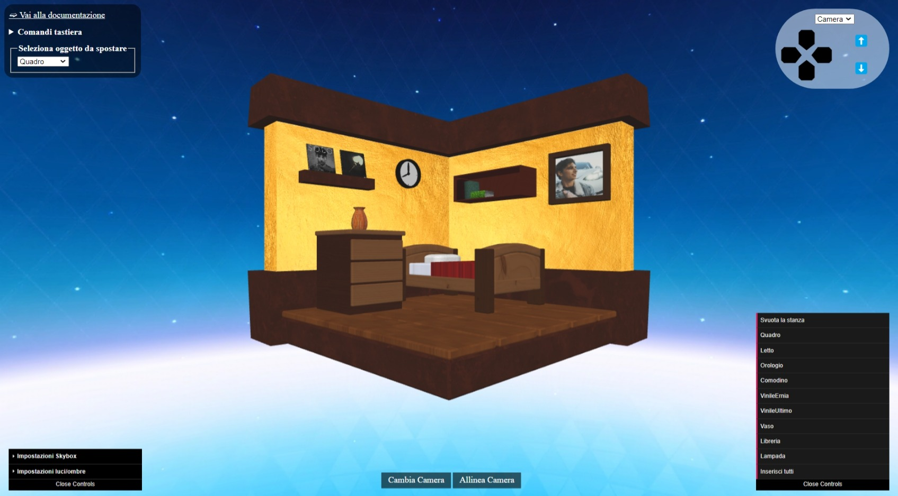

# 📗 Progetto

Questo progetto è stato sviluppato come prova d'esame per il corso di Computer Graphics del Corso di Laurea Magistrale in Informatica (Curriculum B), presso l'Università di Bologna.

All'interno di questa documentazione sono contenuti dettagli inerenti alle scelte di sviluppo.

L'obiettivo del progetto è sviluppare una "3D-WebApp" usando WebGL (HTML5, CSS e contesto WebGL), linguaggio JavaScript e OpenGL ES SL.

---

## 🗿 Soggetto dell'applicazione

Il progetto prende ispirazione da giochi di arredamento e consiste in un'applicazione web che permette di visualizzare una scena 3D (inizialmente composta da una stanza vuota) e muoversi liberamente in essa tramite tastiera e mouse o controller.

Tramite l'apposito menu è possibile aggiungere o rimuovere diversi oggetti e spostarli dove si preferisce attraverso la tastiera o il controller 2D posizionato in alto a destra.

È possibile anche modificare alcune impostazioni grafiche attraverso il menù in basso a sinistra. L'applicazione è stata testata su dispositivi mobili, Windows e Linux.

---

## 💼 File

I file che compongono il progetto sono i seguenti:

- **📁 data**: cartella che contiene immagini, file `.mtl`, file `.obj` e file `.blend` degli oggetti.
- **📁 librerie**: cartella che contiene le librerie fornite dal professore (`dat.gui.js`, `glm_utils.js`, `jquery_3.6.1.js`, `m4.js`, `mesh_utils.js`, `ui_components.js`, `webgl-utils.js`).
- **📁 scene**:
  - **📄 scene.js**: classe principale che si occupa di tutte le operazioni, dall'inizializzazione del canvas e delle mesh, al rendering.
  - **📄 camera.js**: classe che gestisce la camera e i suoi movimenti.
  - **📄 animated_camera.js**: classe che gestisce la camera che si muove automaticamente.
  - **📄 mesh_obj.js**: classe per la gestione degli oggetti da disegnare.
- **📄 main.js**: main del programma.
- **📄 utils.js**: file che contiene funzioni riguardanti gli oggetti, i menù e il controller (tastiera/mouse/touch).
- **📄 webapp.html**: il file principale che contiene l'app.

---

## 💻 Interfaccia



Quando avviamo l'applicazione possiamo notare che al centro dello schermo troviamo la scena contenente una stanza vuota.

- ↘ **In basso a destra**: troviamo il menù (realizzato utilizzando la libreria `dat.gui.js`) dove possiamo piazzare o rimuovere oggetti.
- ↓ **In basso al centro**:
  - **Cambia Camera**: permette di attivare la camera animata che gira intorno alla stanza.
  - **Allinea Camera**: allinea la camera sull'asse verticale e obliqua.
- ↙ **In basso a sinistra**: troviamo il menù per gestire le impostazioni grafiche:
  - **skybox**: on/off e switch (possibilità di alternare tra skybox iniziale e una completamente bianca).
  - **luce**: posizione, colore (modifica anche il colore della skybox), direzione.
  - **ombre**: on/off rendering avanzato, FOV, width, height, far, bias, frustum on/off.
- ↖ **In alto a sinistra**: link per la documentazione, comandi tastiera e selezione dell'oggetto da spostare.
- ↗ **In alto a destra**: controller per muovere la camera e gli oggetti, in base alla selezione.

---

## 🎮 Comandi

Attraverso la tastiera o il controller è possibile spostarsi nella scena e spostare gli oggetti (solo se già presenti nella scena).

### Comandi Tastiera:
- **W/S**: camera avanti/indietro
- **A/D**: camera sinistra/destra
- **Space/Shift**: camera sopra/sotto
- **1/3**: inclina in alto/basso
- **4/6**: panoramica a sinistra/destra
- **7/9**: camera ruota a sinistra/destra
- **Freccia Su/Giù**: sposta oggetto avanti/indietro
- **Freccia Sinistra/Destra**: sposta oggetto sinistra/destra
- **Q/E**: sposta oggetto in alto/basso
- **R**: allinea la camera

È possibile ruotare la camera nelle varie direzioni tramite mouse o touch sul canvas.

---

## 🪑 Aggiungere un nuovo oggetto

È possibile aggiungere un nuovo oggetto alla scena seguendo questi passaggi:

1. Inserire nella cartella `data` una nuova cartella contenente un file `.mtl` e un file `.obj`. I nomi dei file e della cartella devono essere identici.
2. Modificare il file `utils.js` inserendo il nuovo oggetto nella costante `objects`:

   ```js
   { name: 'NomeCartella', position: [z, x, y] }
   ```

Una volta completato, l'oggetto potrà essere aggiunto dal menù e selezionato per essere spostato.

### 🚪 Cambiare stanza

Per cambiare stanza:

1. Inserire nella cartella `data` una nuova cartella contenente un file `.mtl` e un file `.obj`. I nomi dei file e della cartella devono essere identici.
2. Modificare il file `main.js` sostituendo "stanzetta" con il nome della nuova cartella nella riga 11:

   ```js
   window["scene"] = new Scene("canvas", [createObj('nomeCartella', [0, 0, 0])]);
   ```

---

## 🎡 Scelte progettuali

Sono state implementate diverse funzionalità:

- **Vertex shader**: trasforma i vertici del modello 3D allo spazio della scena per il rendering corretto.
- **Fragment shader**: determina il colore di ogni pixel sullo schermo.
- **Rendering di base**: texture e colori con luce diffusa e speculare. Illumina con il modello di Phong e texture mapping.
- **Rendering avanzato (Shadow Mapping)**: genera ombre tramite shadow maps. Può essere attivato dal menù in basso a sinistra.
- **Caricamento modelli**: supporta file wavefront `.OBJ` con `.MTL` associati.
- **Skybox**: implementata tramite cubemap.
- **Context 2D**: utilizzato per disegnare il controller sovrapposto al canvas.
- **Adattamento mobile**: interfaccia adattata per PC e smartphone, test tramite strumenti di sviluppo di Google Chrome.

Librerie utilizzate: `m4.js`, `dat.gui.js`, `webgl-utils.js`.

### 💥 Particolarità

- Gli oggetti vengono cancellati e aggiunti in una nuova posizione per essere spostati.
- I colori della Skybox possono essere modificati dal menù in basso a sinistra.
- Un'immagine dell'autore si trova nel quadro, aggiungibile dal menù in basso a destra.

---

## 🔭 Lavori Futuri

In futuro si potrebbero aggiungere diverse funzionalità, ad esempio:

- **Oggetti e scene**: aggiungere nuovi oggetti, stanze, collisioni, gravità e rotazioni.
- **Obiettivi**: creare livelli sempre più difficili dove copiare l'arredamento di altre stanze.
- **Caricamento e download di oggetti**: aggiungere il caricamento di oggetti e scene tramite un server e la possibilità di scaricarli per modificarli localmente.
